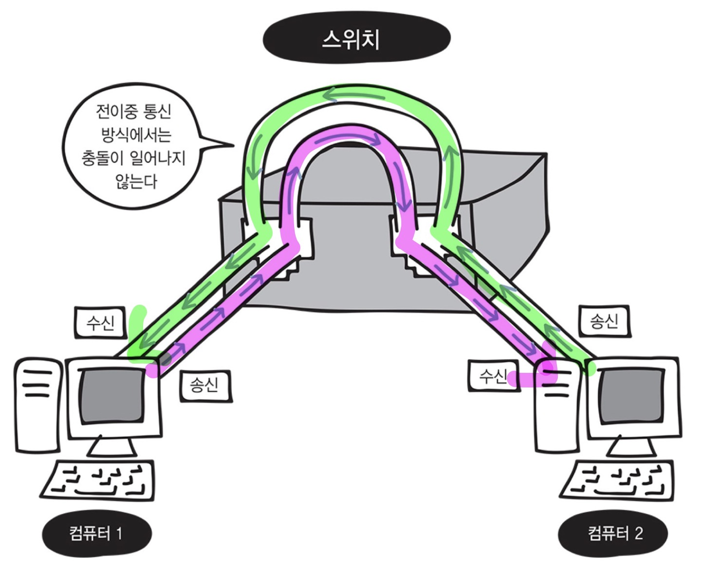

# 전이중통신과 반이중 통신

## 전이중 통신 방식

데이터 송수신을 동시에 통신하는 방식

ex) 컴퓨터 두대 이상을 직접 연결하는 방식, 스위치를 사용하는 방식

## 반이중 통신 방식

회선 하나로 송신과 수신을 번갈아가면서 통신하는 방식

ex) 허브를 사용하여 컴퓨터를 연결하는 방식

허브 내부에는 송수신이 나눠져 있지 않기 때문에 회선 하나를 송신과 수신이 번갈아가면서 사용하여 동시에 데이터를 보낼 때 충돌이 일어난다.

## 충돌 도메인

- 충돌이 발생할 때 그 영향이 미치는 범위를 충돌 도메인이라고 한다.
    
    ex) 허브로 연결되어있는 컴퓨터 전체가 하나의 충돌 도메인
    
- 충돌 도메인의 범위가 넓을 수록 네트워크가 지연된다.

## 전이중 통신 방식을 사용하는 스위치

스위치는 전송하면서 동시에 수신도 가능하기 때문에 효율이 매우 높다.

충돌 도메인의 범위가 좁다.

