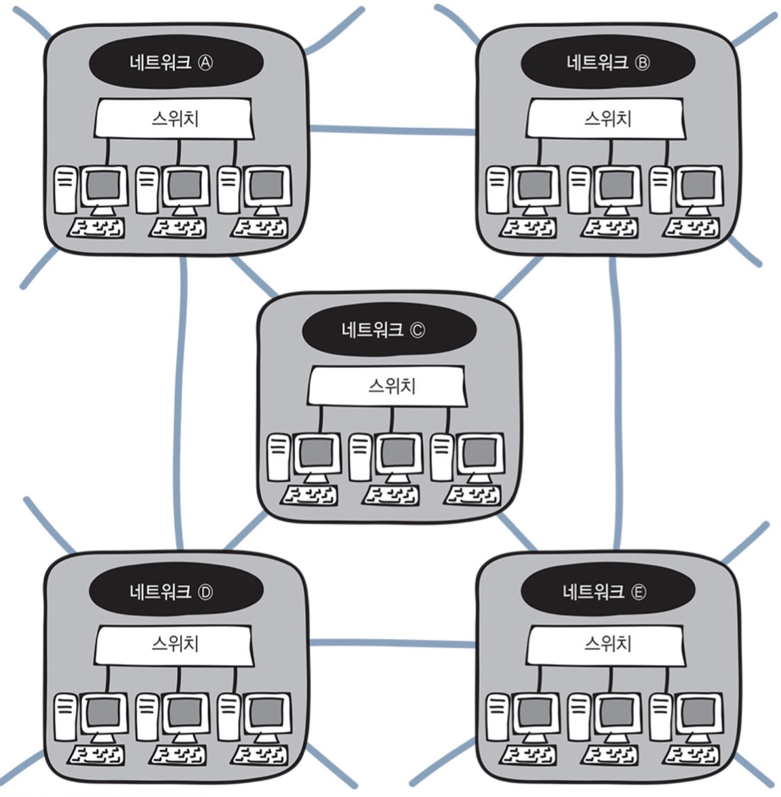

# 네트워크 계층의 역할

### 네트워크 계층

- 네트워크간의 통신을 가능하게 하여 서로 다른 네트워크에 있는 목적지로 데이터를 전달

### 데이터 링크 계층과의 차이

- 데이터 링크 계층 (스위치)
    - 이더넷 규칙을 기반으로 데이터를 전송
    - 같은 네트워크에 있는 컴퓨터로는 데이터를 전송
- 네트워크 계층 (라우터)
    - 인터넷이나 다른 네트워크로 데이터 전송
    - 

### IP 주소

- 어떤 네트워크의 어떤 컴퓨터인지 구분하는 주소
- 다른 네트워크의 **목적지를 지정**할 수 있게 한다.

### 라우팅

- 목적지 IP 주소까지 어떤 경로로 데이터를 보낼지 결정하는 것
- **라우터** 네트워크 장비가 필요
- 레이어 3 스위치 장비로 라우팅 가능

### 라우터

- 네트워크 계층을 통해 **다른 네트워크로 데이터를 전송**하기 위해 필요한 **네트워크 장비**
- 정해진 데이터의 목적지까지 **어떤 경로**로 가는 것이 좋은지 알려주는 기능

### 라우팅 테이블

- 라우터에 존재하는 경로 정보를 등록, 관리
