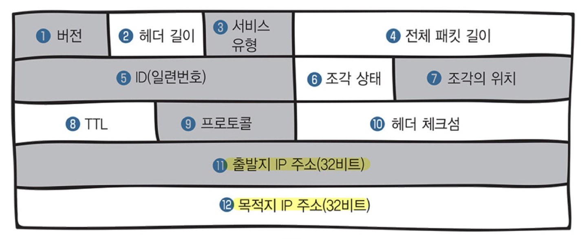

# IP

### IP 란

IP (Internet Protocal) 는 인터넷 환경에서의 통신 규약

IP의 특징은 비 신뢰성(Unreliability)과, 비 연결성(Connectionlessness)

### IP 헤더

- 네트워크 계층에서는 캡슐화할 때 **데이터 앞에 IP헤더**를 붙인다
- 데이터를 정확하게 전달하기 위한 필요한 정보를 담음

1. 버전
2. 헤더 길이
3. 서비스 유형
4. 전체 패킷 길이
5. ID(일련번호)
6. 조각 상태
7. 조각의 위치
8. TTL
9. 프로토콜
10. 헤터 체크썸
11. **출발지 IP 주소**
12. **목적지 IP 주소**

### IP 패킷

IP 프로토콜을 사용하여 캡슐화할 때 데이터에 IP헤더를 추가하여 만들어진 것

cf) 데이터 링크 계층 - 프레임
