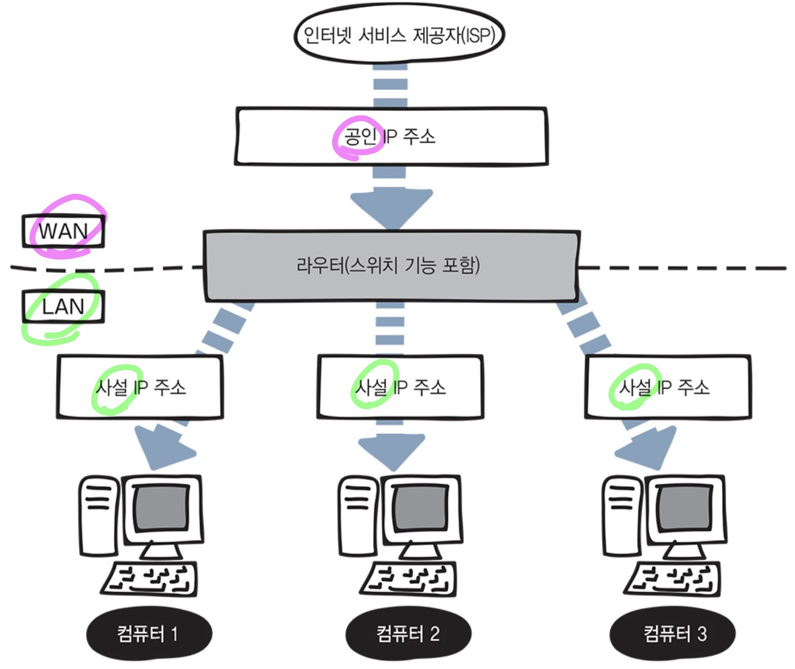

# IP 주소의 구조

### IP 주소

- 어떤 네트워크의 어떤 컴퓨터인지 구분하는 주소
- 다른 네트워크의 **목적지를 지정**할 수 있게 한다.
- **인터넷 제공자(ISP)**가 제공한다.

### IP 버전

- IPv4
    - 32비트 - 약 43억개의 IP 주소를 만들 수 있음
- IPv6
    - 128비트 - 약 340간개 사실상 무한개의 IP 주소를 만들 수 있음

### IP 주소의 종류 (IPv4 기준)

- 공인 IP 주소
    - 네트워크가 커질 수록 사용할 수 있는 공인 IP 주소가 제한되므로 인터넷에 직접 연결되는 컴퓨터나 라우터에 할당
    - **인터넷 제공자(ISP)**가 제공
- 사설 IP 주소
    - 회사나 가정의 랜(LAN)에 있는 컴퓨터에는 랜의 네트워크 관리자가 자유롭게 사설 IP 주소를 할당
    - 라우터의 DHCP 기능을 사용하여 주소를 자동으로 할당

결국, **공인 IP 주소 한개로** 랜 안에 있는 **컴퓨터 여러 대에 인터넷을 모두 연결**할 수 있는 **환경**을 만들 수 있음

### IP 주소 표현

- IP 주소는 32비트로 구분하기 쉽도록 10진수로 표현
- 8비트 단위로 나눠서 표시, **8비트를 옥텟(octet)** 이라 칭함
- 10진수로 표시하지만 **실제 IP주소는 2진수**이다.

### 두가지 정보로 나눠져있는 IP 주소

- 네트워크 ID
    - **어떤 네트워크** 인지 나타냄
- 호스트 ID
    - 네트워크 ID에 해당되는 네트워크의 **어느 컴퓨터** 인지 나타냄

# IP 주소의 클래스

### IP 주소 클래스

- 네트워크 ID를 크게 만들거나 호스트 ID를 작게 만들어 네트워크 크기를 조정할 수 있는데 **네트워크 크기는 클래스 개념으로 구분**

### 클래스 종류

- A클래스
    - 대규모 네트워크 주소
    - 네트워크 ID 8비트, 호스트 ID 24비트 - **8 : 24**
    - 1옥텟(8비트) 범위
        - 2진수 : 00000001~11111111
        - 10진수 : 1~127
    - 최대 호스트 수 1677만 7214대
    
    
    
- B클래스
    - 중형 네트워크 주소
    - 네트워크 ID 16비트, 호스트 ID 16비트 - **16 : 16**
    - 1옥텟(8비트) 범위
        - 2진수 : 1000000~10111111
        - 10진수 : 128~191
    - 최대 호스트 수 6만 5534대
    
    
    
- C클래스
    - 소규모 네트워크 주소
    - 네트워크 ID 24비트, 호스트 ID 8비트 - **24 : 8**
    - 1옥텟(8비트) 범위
        - 2진수 : 1100000~11011111
        - 10진수 : 192~223
    - 최대 호스트 수254개
    
    
    
- D클래스
    - 멀티캐스트 주소
- E클래스
    - 연구 및 특수용도 주소
    

### 공용 IP 주소 범위

### 사설 IP 주소 범위

