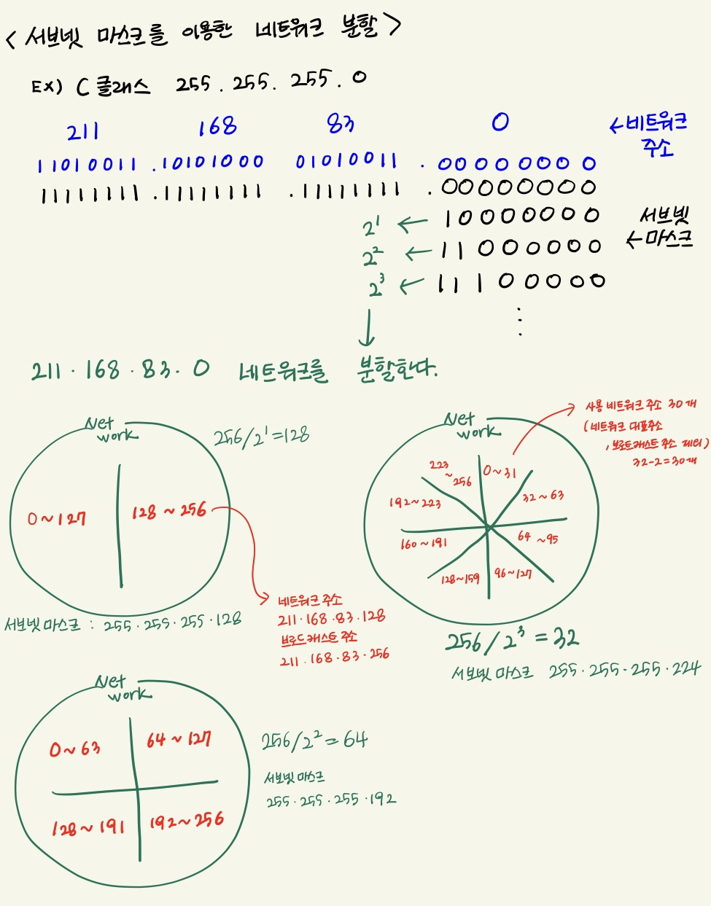

# 서브넷 구조

많은 수의 컴퓨터가 브로드캐스트 패킷을 전송하면 모든 컴퓨터에 패킷이 전송되고 네트워크가 호잡해진다.

### 서브넷팅

- 네트워크를 분할하는 것

### 서브넷

- 분할된 네트워크
- 기존에 네트워크 ID + 호스트 ID → 네트워크 ID + 서브넷 ID + 호스트 ID
- 호스트 ID에서 비트를 빌려서 서브넷으로 변경
- 대규모 네트워크를 작은 네트워크로 분할하여 브로드캐스트로 전송되는 패킷의 범위를 좁힐 수 있다

### 서브넷 마스크

- 네트워크 ID와 호스트 ID를 식별하기 위한 값
- A클래스 - 255 . 0 . 0 . 0
- B클래스 - 255 . 255 . 0 . 0
- C클래스 - 255 . 255 . 255 . 0

### 프리픽스 표기법

- 서브넷 마스크를 슬래시(/비트수) 로 나타낸 것
- ex) 서브넷 마스크 : 11111111 11111111 11110000 00000000 == /22 (B클래스 서브넷 마스크)
