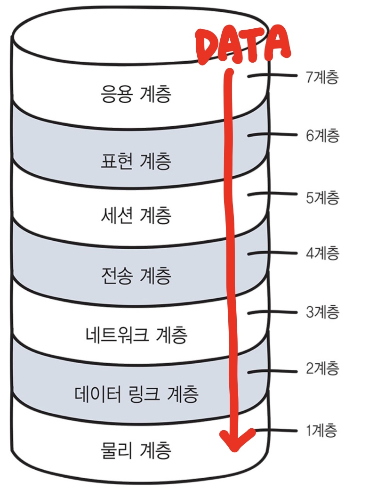
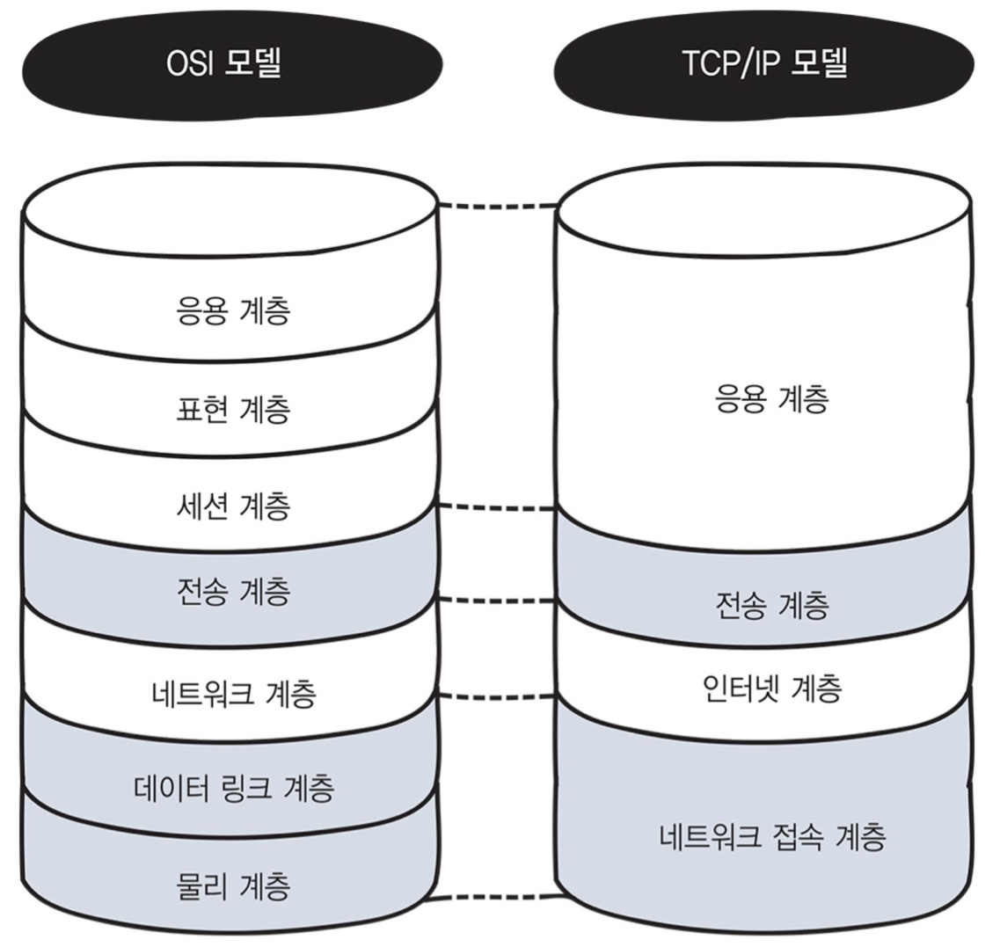

# 네트워크의 규칙

### 프로토콜이란?

컴퓨터와 컴퓨터가 통신하기 위한 네트워크의 통신 규칙을 프로토콜이라고한다.

## OSI 모델과 TCP/IP 모델

### OSI 모델

ISO 국제포준화기구에서 OSI라는 표준 규격을 제정하였다.

- 컴퓨터에서 컴퓨터로 데이터를 전송할 때 컴퓨터 내부에서는 여러가지 일을 수행한다.
- 이 일들을 7계층(Layer)으로 나누어한다.
- 데이터는 맨위의 응용계층부터 순차적으로 아래 계층으로 전달된다.

### 7계층의 역할

각 계층은 독립적이므로 데이터가 전달되는 동안에는 다른 계층의 영향을 받지 않는다.

### TCP/IP 모델

OSI 모델인 7계층을 4계층으로 만든 모델

각 계층에는 다양한 프로토콜들이 있다.
