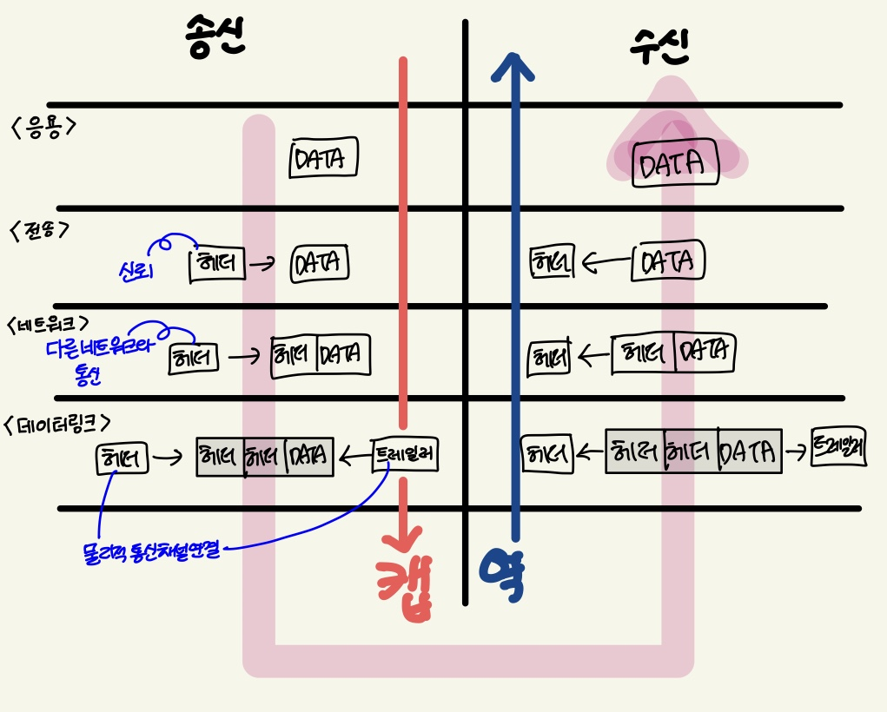

# 캡슐화와 역캡슐화

## 캡슐화와 역캡슐화란?

- 데이터를 전송할 때는 데이터의 앞 부분에 필요한 정보를 붙여서 보낸다.
- 이 정보를 헤더라고하고 헤더를 차례로 붙여나가는것을 **캡슐화**라고한다.
- 헤더를 차례로 제거하는 것을 **역캡슐화**라고 한다.
- 헤더에는 데이터를 전달받을 상대방에 대한 정보도 포함되어있다.

1. 응용계층 : 웹사이트를 접속하기 위한 요청 데이터를 만든다.
2. 전송계층 : 신뢰할 수 있는 통신이 이루어지도록 응용 계층에서 만들어진 데이터에 헤더를 붙인다
3. 네트워크 계층 : 전송계층에서 만들어진 데이터에 다른 네트워크와 통신하기 위해 헤더를 붙인다.
4. 데이터 링크 계층 : 네트워크 계층에서 만들어진 데이터에 물리적인 통신 채널을 연결하기위해 헤더와 트레일러를 붙인다.
    
    (트레일러 : 전송하는 데이터의 맨 뒤에 붙어서 데이터 전송 중 오류가 발생하는지 확인하는 역할로 `FCS(Frame Check Sequence)`라고도 한다. → 여기까지 캡슐화
    
5. 반대로 수신측에서는 각 계층의 헤더를 제거하면서 데이터를 전달하고 데이터 링크 계층부터 순서대로 상위 계층으로 전달한다. → 역캡슐화
