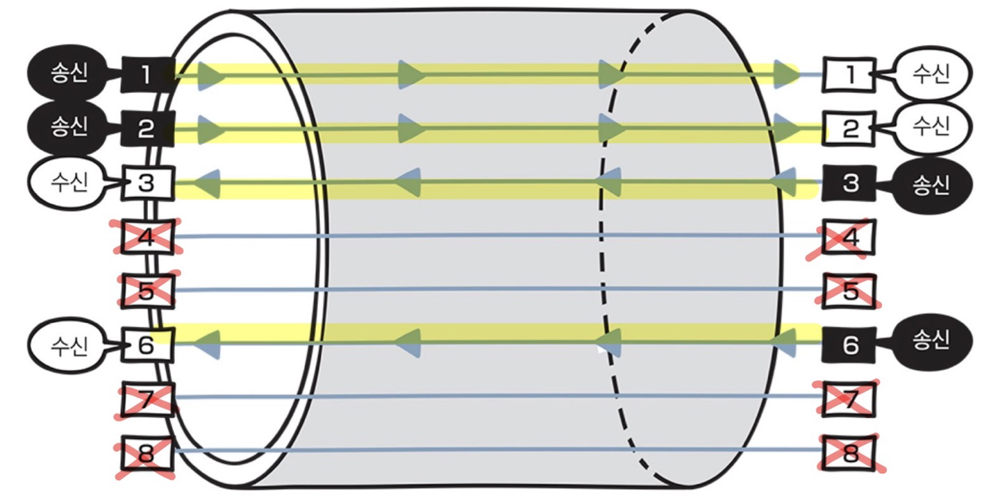
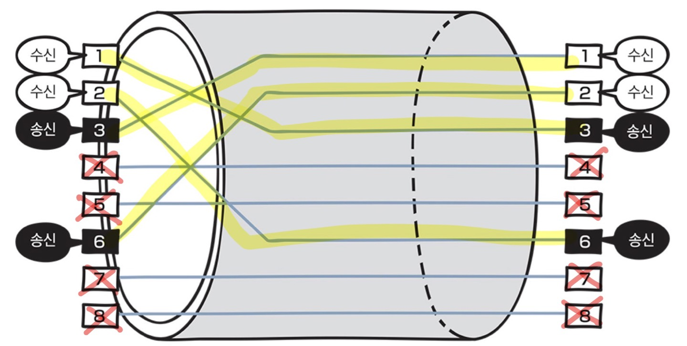

# 케이블의 종류와 구조

## 네트워크의 전송 매체

데이터가 흐르는 물리적인 선로이며 유선과 무선으로 나뉜다.

유선 - 트위스트 페어 케이블(랜 케이블 ~~랜 선~~), 광케이블

무선 - 라디오파, 마이크로파, 적외선

## 트위스트 페어 케이블(랜 케이블, 흔히 말하는 랜 선)

- 랜 케이블의 양쪽 끝에는 RJ-45 커넥터가 붙어있다.
- 커넥터를 랜 포트나 네트워크 기기에 연결한다.

종류

- UTP 케이블 (Unshielded Twist Pair, 비차폐 연선)
    - 구리 선 여덟개를 두 개씩 꼬아 만든 네쌍의 전선으로 **실드로 보호되어있지 않은 케이블**
    - 보호되어 있지 않아 **노이즈의 영향을 받기 쉬움**
    - 가격이 저렴하여 일반적으로 많이 사용
    - 전송 품질에 따라 **분류**할 수 있다.
- STP 케이블 (shielded Twist Pair, 차폐 연선)
    - 구리 선 여덟개를 두 개씩 꼬아 만든 네쌍의 전선으로 **실드로 보호하는 케이블**
    - 보호되어 있어 **노이즈의 영향을 매우 적게 받음**
    - 가격이 비쌈

참고

- 실드란? 금속 호일이나 금속의 매듭과 같은 것으로 **외부에서 발생하는 노이즈를 막는 역할**
- 노이즈란? 케이블에 전기 신호가 흐를 때 발생, 노이즈 영향을 받으면 전기 신호의 형태가 왜곡된다

## 다이렉트 케이블과 크로스 케이블

두 케이블 모두 구리선 8개를 전부 사용하는 것이 아니라 1,2,3,6번 구리 선을 사용한다.

### 다이렉트 케이블

- 구리 선 여덟 개를 **같은 순서**로 커넥터에 연결한 케이블
- 컴퓨터와 스위치를 연결할 때 사용
- 한 쪽은 1,2 번으로 송신하고 3,6번으로 수신한다. 다른 쪽은 3,6번으로 송신하고 1,2번으로 수신한다.

### 크로스 케이블

- 구리 선 여덟 개 중 한쪽 커넥터의 1번과 2번에 연결되는 구리 선을 다른 쪽 커넥터의 3번과 6번에 연결한 케이블
- 컴퓨터 간에 직접 랜 케이블로 연결할 때 사용
- 양 쪽 다 1,2번으로 송신하고 3,6번으로 수신한다. ( 양쪽 컴퓨터 모두 1,2번을 통해서 수신하게 된다면 데이터가 충돌하기 때문)
