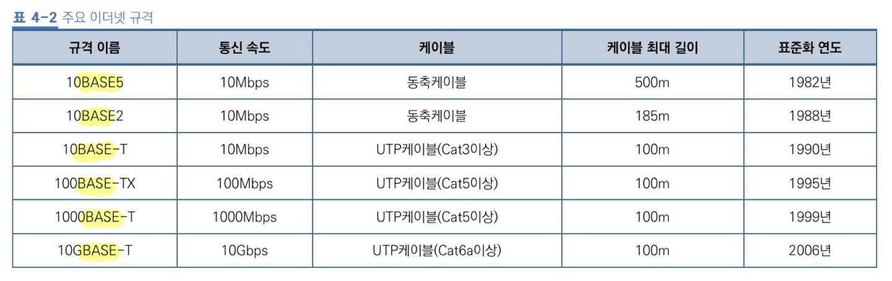

# 데이터 링크 계층의 역할 과 이더넷
## 데이터 링크 계층

네트워크 장비 간에 신호를 주고 받는 규칙을 정하는 계층

랜에서 데이터를 주고 받으려면 데이터 링크 계층의 기술이 필요

가장 많이 사용되는 규칙 **이더넷**이다.

## 이더넷

- 랜에서 적용되는 규칙
- **허브**와 같은 장비에 연결된 컴퓨터와 **데이터를 주고받을 때** 사용한다.
- 보내려는 데이터에 **목적지 정보를 추가**해서 보내고 목적지 **이외의 컴퓨터는** 데이터를 받더라도 **무시**한다.
- 여러 컴퓨터가 동시에 데이터를 전송해도 데이터 충돌이 일어나지 않는 구조로 되어있다.
- CSMA/CD (Carrier Sense Multiple Access with Collision Detection) : 이더넷에서 데이터를 보내는 시점을 늦추는 방법
    - CS : 데이터를 보내려고 하는 컴퓨터가 케이블에 신호가 흐르고 있는지 아닌지 확인
    - MA : 케이블에 데이터가 흐르고 있지 않다면 데이터를 보내도 좋다는 규칙
    - CD : 충돌이 발생하고 있는지를 확인
    - 효율이 좋지 않아 거의 사용하지 않음

## 이더넷의 종류와 특징

### 이더넷 규격

- 통신속도
- 전송 방식
    - BASE - BASEBAND라는 전송 방식
- 케이블의 종류(UTP 케이블) or 케이블의 최대길이(동축케이블)
    - 동축케이블은 케이블의 최대길이를 100미터 단위로 표시한다.
    

ex) 10BASE5 : 동축케이블, 케이블 최대 길이 500미터

10BASE-T : UTP 케이블
